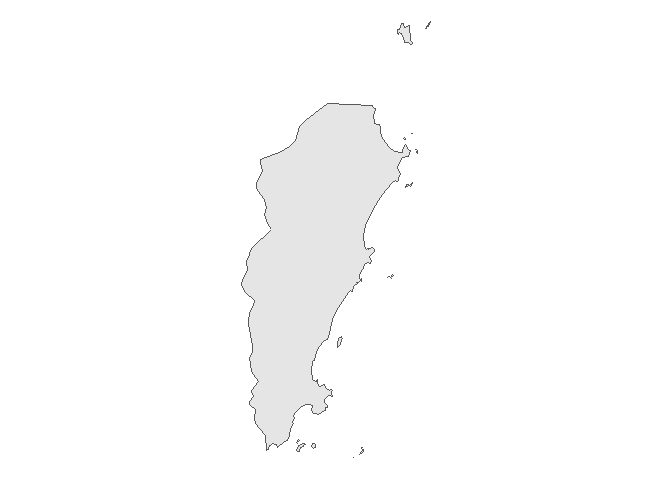
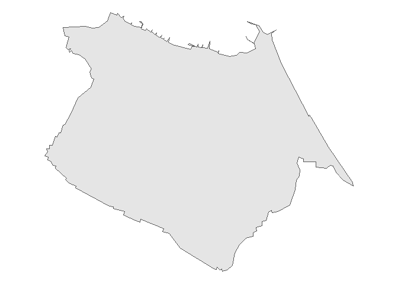
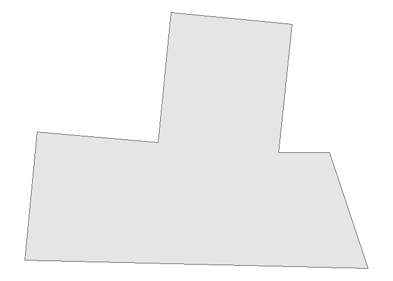
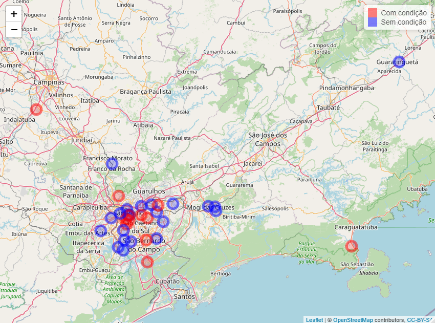

<!-- README.md is generated from README.Rmd. Please edit that file -->

# milton

<!-- badges: start -->

[](https://lifecycle.r-lib.org/articles/stages.html#experimental)
[](https://github.com/tomasbarcellos/milton/actions)
[](https://app.codecov.io/gh/tomasbarcellos/milton?branch=main)
<!-- badges: end -->

O objetivo de milton é oferecer ferramentas para facilitar o
georreferenciamento de dados no Brasil.

## Instalação

Você pode instalar a versão de desenvolvimento de milton do
[GitHub](https://github.com/) com o código abaixo:

``` r
# install.packages("devtools")
devtools::install_github("tomasbarcellos/milton")
```

``` r
library(milton)
```

# Georreferenciando endereços

O pacote permite que você georrefenrencie seus dados com:

1.  Endereço
2.  CEP

``` r
av <- get_addr("Avenida pequeno príncipe")
av
#> Geometry set for 1 feature 
#> Geometry type: POINT
#> Dimension:     XY
#> Bounding box:  xmin: -48.4922 ymin: -27.68202 xmax: -48.4922 ymax: -27.68202
#> Geodetic CRS:  SIRGAS 2000
#> POINT (-48.4922 -27.68202)
# CEP da avenida pequeno principe
get_addr("88063-000")
#> Geometry set for 1 feature 
#> Geometry type: POINT
#> Dimension:     XY
#> Bounding box:  xmin: -48.49422 ymin: -27.6804 xmax: -48.49422 ymax: -27.6804
#> Geodetic CRS:  SIRGAS 2000
#> POINT (-48.49422 -27.6804)
```

# Identificando pertencimento

Carregando funções de utilidade para ler e manipular dados.

``` r
library(tidyverse)
#> -- Attaching packages --------------------------------------- tidyverse 1.3.1 --
#> v ggplot2 3.3.5     v purrr   0.3.4
#> v tibble  3.1.5     v dplyr   1.0.7
#> v tidyr   1.1.4     v stringr 1.4.0
#> v readr   2.0.2     v forcats 0.5.1
#> -- Conflicts ------------------------------------------ tidyverse_conflicts() --
#> x dplyr::filter() masks stats::filter()
#> x dplyr::lag()    masks stats::lag()
```

Também é possível identificar o município e o setor censitário de um
endereço. Para tanto precisamos dos endereços que vamos localizar e as
geometrias em que eles devem ser identificados.

``` r
mun <- geobr::read_municipality(year = 2018) %>% 
  rename(geometry = geom)
```

A função `geopart` permite fazê-lo.

``` r
geo_av <- geopart(av, mun)
ggplot(mun[geo_av, ]) +
  geom_sf() +
  theme_void()
```



A API do pacote foi construída buscando permitir o uso do pipe (`%>%`).

``` r
geo_museu <- get_addr("Museu da Língua Portuguesa") %>% 
  geopart(mun)

ggplot(mun[geo_museu, ]) +
  geom_sf() +
  theme_void()
```



Para a identificação do setor censitário também é possível usar a mesma
função. Para tanto deve-se usar como segundo argumento os polígonos dos
setores censitários. Uma forma fácil de acessar esses polígonos é usando
o pacote `geobr`: `geobr::read_census_tract`.

``` r
setores <- geobr::read_census_tract(3550308) %>% 
  rename(geometry = geom)
```

Com estes polígonos em mãos é possível identificar o setor censitário ao
qual determinado endereço pertence.

``` r
epm <- get_addr("Rua botucatu, 740")

geo_epm <- geopart(epm, setores)

ggplot(setores[geo_epm, ]) +
  geom_sf() +
  theme_void()
```



Outra funcionalidade do pacote permite relacionar endereços distintos,
medindo suas distâncias ou identificando o local mais próximo.

Suponhamos que tenhamos uma tabela com os endereços os pacientes A, B e
C:

``` r
pacientes <- tibble(
  paciente = LETTERS[1:3],
  endereco = c(
    "Av. Dr. Altino Arantes, 941",
    "Rua Gandavo, 349, São Paulo",
    "Rua Bela cruz, 40"
  )
) %>% 
  mutate(latlon = get_addr(endereco))

pacientes
#> # A tibble: 3 x 3
#>   paciente endereco                                   latlon
#>   <chr>    <chr>                                 <POINT [°]>
#> 1 A        Av. Dr. Altino Arantes, 941  (-46.6368 -23.60279)
#> 2 B        Rua Gandavo, 349, São Paulo (-46.64136 -23.59199)
#> 3 C        Rua Bela cruz, 40            (-46.5806 -23.57739)
```

E agora é possível calcular a distância entre esses pontos e a Escola
Paulista de Medicina.

``` r
pacientes %>% 
  mutate(distancia_km = distancia(latlon, epm))
#> # A tibble: 3 x 4
#>   paciente endereco                                   latlon distancia_km[,1]
#>   <chr>    <chr>                                 <POINT [°]>            <dbl>
#> 1 A        Av. Dr. Altino Arantes, 941  (-46.6368 -23.60279)            0.752
#> 2 B        Rua Gandavo, 349, São Paulo (-46.64136 -23.59199)            0.827
#> 3 C        Rua Bela cruz, 40            (-46.5806 -23.57739)            6.82
```

Há um conjunto de funções que permite identificar, por exemplo, o local
mais adequado para tratar determinado paciente:

1.  `min_dist` retorna a menor distância;
2.  `nearplace` retorna o local mais próximo.

Desse modo, dado um conjunto de hospitais:

``` r
hospitais <- c("Hospital São Paulo", 
               "Hospital Dom Alvarenga",
               "Hospital Paulistano")

geo_hospitais <- get_addr(hospitais)
```

É possível identificar a distância dos hospitais para o paciente C:

``` r
paciente_C <- pacientes$latlon[3]
distancia(paciente_C, geo_hospitais)
#>          [,1]     [,2]    [,3]
#> [1,] 6.802523 3.571139 6.42353
```

Assim como o hospital de menor distância.

``` r
min_dist(paciente_C, geo_hospitais)
#> [1] 3.571139
```

E o hospital mais próximo.

``` r
prox <- nearplace(paciente_C, geo_hospitais)
idx <- which(prox == geo_hospitais)
hospitais[idx]
#> [1] "Hospital Dom Alvarenga"
```

# Usando CEPs

Tomemos um conjunto qualquer de CEPs.

``` r
df_ceps <- tibble(
  ceps = c("01215010", "01508010", "01519000", "01526010", "02180080", 
          "02849170", "03347070", "03380150", "03590080", "03737230", 
          "04011060", "04018000", "04050060", "04108001", "04111000",
          "04233140", "04421150", "04433180", "04633030", "04813190",
          "04853185", "05010000", "05409002", "05540020", "05790230",
          "06000150", "07717170", "07858150", "07865115", "08062320", 
          "08140000", "08142710", "08370220", "08421520", "08700000",
          "08770130", "08790000", "08793030", "09911550")
)
```

Assumamos que representam o endereço de pacientes cujas condições estão
apresentadas na tabela abaixo.

``` r
set.seed(123)
df_pacientes <- df_ceps %>% 
  mutate(
    id = seq_along(ceps),
    condicao = sample(c(0, 1), length(ceps), replace = TRUE)
  )

df_pacientes
#> # A tibble: 39 x 3
#>    ceps        id condicao
#>    <chr>    <int>    <dbl>
#>  1 01215010     1        0
#>  2 01508010     2        0
#>  3 01519000     3        0
#>  4 01526010     4        1
#>  5 02180080     5        0
#>  6 02849170     6        1
#>  7 03347070     7        1
#>  8 03380150     8        1
#>  9 03590080     9        0
#> 10 03737230    10        0
#> # ... with 29 more rows
```

Agora usemos as funções do pacote para complementar nosso bando de dados
com:

1.  Georreferenciamento dos pacientes
2.  Identificação do setor censitário em que os pacientes estão
    localizados
3.  Relacionamento com dados do IPVS do referido setor censitário
4.  Identificação do ponto mais próximo de cada paciente (dado uma
    lista)
5.  Cálculo da distância entre os pacitentes e o ponto definido em 4)
6.  Criar mapa dos pacientes (leaflet)

### 1. Georreferenciamento dos pacientes

``` r
geo_pacientes <- df_pacientes %>% 
  mutate(endereco = cep(ceps),
         ponto = get_addr(endereco))
geo_pacientes
#> # A tibble: 39 x 5
#>    ceps        id condicao endereco                                        ponto
#>    <chr>    <int>    <dbl> <chr>                                     <POINT [°]>
#>  1 01215010     1        0 Rua Helvétia, São Paulo          (-46.64122 -23.5331)
#>  2 01508010     2        0 Rua Taguá, São Paulo            (-46.63652 -23.56167)
#>  3 01519000     3        0 Rua do Lavapés, São Paulo       (-46.62748 -23.56164)
#>  4 01526010     4        1 Rua Tenente Otávio Gomes, São ~ (-46.63209 -23.56342)
#>  5 02180080     5        0 Rua Soldado Manasses de Aguiar~ (-46.56587 -23.51827)
#>  6 02849170     6        1 Rua Bernardo Rincon, São Paulo  (-46.68629 -23.46706)
#>  7 03347070     7        1 Rua Maestro Artur Elias Kauffm~  (-46.5665 -23.56242)
#>  8 03380150     8        1 Rua Cruzeiro dos Peixotos, São~ (-46.53379 -23.57575)
#>  9 03590080     9        0 Rua Padre Manuel Barreto, São ~ (-46.48273 -23.54557)
#> 10 03737230    10        0 Rua Conceição do Rio Verde, Sã~ (-46.50943 -23.51041)
#> # ... with 29 more rows
```

### 2. Identificação do setor censitário em que os pacientes estão localizados

``` r
setor_paciente <- geo_pacientes %>% 
  mutate(idx = map_int(ponto, geopart, setores),
         setor = setores$code_tract[idx])
setor_paciente
#> # A tibble: 39 x 7
#>    ceps        id condicao endereco                           ponto   idx setor 
#>    <chr>    <int>    <dbl> <chr>                        <POINT [°]> <int> <chr> 
#>  1 01215010     1        0 Rua Helvétia, São~  (-46.64122 -23.5331) 13923 35503~
#>  2 01508010     2        0 Rua Taguá, São Pa~ (-46.63652 -23.56167) 10240 35503~
#>  3 01519000     3        0 Rua do Lavapés, S~ (-46.62748 -23.56164) 10223 35503~
#>  4 01526010     4        1 Rua Tenente Otávi~ (-46.63209 -23.56342) 10167 35503~
#>  5 02180080     5        0 Rua Soldado Manas~ (-46.56587 -23.51827) 17418 35503~
#>  6 02849170     6        1 Rua Bernardo Rinc~ (-46.68629 -23.46706)  1001 35503~
#>  7 03347070     7        1 Rua Maestro Artur~  (-46.5665 -23.56242)   107 35503~
#>  8 03380150     8        1 Rua Cruzeiro dos ~ (-46.53379 -23.57575) 16920 35503~
#>  9 03590080     9        0 Rua Padre Manuel ~ (-46.48273 -23.54557)   536 35503~
#> 10 03737230    10        0 Rua Conceição do ~ (-46.50943 -23.51041) 12705 35503~
#> # ... with 29 more rows
```

### 3. Relacionamento com dados do IPVS do referido setor censitário

Ler dados do Índice Paulista de Vulnerabilidade Social (IPVS).

``` r
ipvs <- ler_ipvs() %>% 
  select(setor = codigo_do_setor_censitario, 
         idade_media_setor = idade_media_das_pessoas_responsaveis, 
         p_renda_meio_sm_setor =  proporcao_de_domicilios_particulares_com_rendimento_nominal_mensal_de_ate_1_2_s_m,
         p_alfabetizadas_setor = proporcao_de_pessoas_responsaveis_alfabetizadas)
#> Rows: 73 Columns: 2
#> -- Column specification --------------------------------------------------------
#> Delimiter: "\t"
#> chr (2): Variável, Descrição
#> 
#> i Use `spec()` to retrieve the full column specification for this data.
#> i Specify the column types or set `show_col_types = FALSE` to quiet this message.
#> i Using "','" as decimal and "'.'" as grouping mark. Use `read_delim()` for more control.
#> Rows: 66096 Columns: 51
#> -- Column specification --------------------------------------------------------
#> Delimiter: ";"
#> chr  (5): v2, v4, v6, v62, v9
#> dbl (46): v1, v3, v5, v61, v7, v8, v10, v11, v12, v13, v14, v15, v16, v17, v...
#> 
#> i Use `spec()` to retrieve the full column specification for this data.
#> i Specify the column types or set `show_col_types = FALSE` to quiet this message.
```

Relacionar com dados dos pacientes

``` r
paciente_ipvs <- setor_paciente %>% 
  left_join(ipvs, by = "setor")
glimpse(paciente_ipvs)
#> Rows: 39
#> Columns: 10
#> $ ceps                  <chr> "01215010", "01508010", "01519000", "01526010", ~
#> $ id                    <int> 1, 2, 3, 4, 5, 6, 7, 8, 9, 10, 11, 12, 13, 14, 1~
#> $ condicao              <dbl> 0, 0, 0, 1, 0, 1, 1, 1, 0, 0, 1, 1, 1, 0, 1, 0, ~
#> $ endereco              <chr> "Rua Helvétia, São Paulo", "Rua Taguá, São Paulo~
#> $ ponto                 <POINT [°]> POINT (-46.64122 -23.5331), POINT (-46.636~
#> $ idx                   <int> 13923, 10240, 10223, 10167, 17418, 1001, 107, 16~
#> $ setor                 <chr> "355030869000101", "355030849000088", "355030849~
#> $ idade_media_setor     <dbl> 41.70769, 44.28804, 37.60440, 48.37607, 50.01099~
#> $ p_renda_meio_sm_setor <dbl> 9.2105263, 1.1627907, 12.8205128, 2.5641026, 9.8~
#> $ p_alfabetizadas_setor <dbl> 93.53846, 97.82609, 95.97070, 98.71795, 97.80220~
```

### 4. Identificação do ponto mais próximo de cada paciente (dado uma lista)

Dados dois pontos, identificar aquele mais próximo de cada paciente.

``` r
ps <- get_addr(c("04017-030", "Hospital Albert Einstein"))
nomes_ps <- c("Caism Vila Mariana", "Einstein")

paciente_ipvs %>% 
  select(id, condicao, ceps, endereco, ponto) %>% 
  mutate(prox = nearplace(ponto, ps),
         nome_prox = nomes_ps[which_nearplace(ponto, ps)]) %>% 
  glimpse()
#> Rows: 39
#> Columns: 7
#> $ id        <int> 1, 2, 3, 4, 5, 6, 7, 8, 9, 10, 11, 12, 13, 14, 15, 16, 17, 1~
#> $ condicao  <dbl> 0, 0, 0, 1, 0, 1, 1, 1, 0, 0, 1, 1, 1, 0, 1, 0, 1, 0, 0, 0, ~
#> $ ceps      <chr> "01215010", "01508010", "01519000", "01526010", "02180080", ~
#> $ endereco  <chr> "Rua Helvétia, São Paulo", "Rua Taguá, São Paulo", "Rua do L~
#> $ ponto     <POINT [°]> POINT (-46.64122 -23.5331), POINT (-46.63652 -23.56167~
#> $ prox      <POINT [°]> POINT (-46.63795 -23.58774), POINT (-46.63795 -23.5877~
#> $ nome_prox <chr> "Caism Vila Mariana", "Caism Vila Mariana", "Caism Vila Mari~
```

### 5. Cálculo da distância entre os pacitentes e o ponto definido em 4)

``` r
paciente_ipvs %>% 
  select(id, condicao, ceps, endereco, ponto) %>% 
  # Em quilometros
  mutate(distancias = distancia(ponto, ps)) %>%  
  glimpse()
#> Rows: 39
#> Columns: 6
#> $ id         <int> 1, 2, 3, 4, 5, 6, 7, 8, 9, 10, 11, 12, 13, 14, 15, 16, 17, ~
#> $ condicao   <dbl> 0, 0, 0, 1, 0, 1, 1, 1, 0, 0, 1, 1, 1, 0, 1, 0, 1, 0, 0, 0,~
#> $ ceps       <chr> "01215010", "01508010", "01519000", "01526010", "02180080",~
#> $ endereco   <chr> "Rua Helvétia, São Paulo", "Rua Taguá, São Paulo", "Rua do ~
#> $ ponto      <POINT [°]> POINT (-46.64122 -23.5331), POINT (-46.63652 -23.5616~
#> $ distancias <dbl[,2]> <matrix[26 x 2]>
```

### 6. Criar mapa dos pacientes (leaflet)

``` r
library(leaflet)
lat_ps <- unlist(ps[[1]])[2]
lon_ps <- unlist(ps[[1]])[1]

paciente_ipvs %>% 
  mutate(lon = map_dbl(ponto, ~unlist(.x)[1]),
         lat = map_dbl(ponto, ~unlist(.x)[2])) %>% 
  leaflet() %>%
  addTiles() %>%  # Add default OpenStreetMap map tiles
  addCircleMarkers(~lon, ~lat, label = ~p_renda_meio_sm_setor, color = ~ifelse(condicao == 1, "red", "blue")) %>% 
  addMarkers(lon_ps, lat_ps, label = "Caism Vila Mariana") %>% 
  addLegend(colors = c("red", "blue"), labels = c("Com condição", "Sem condição"))
```


