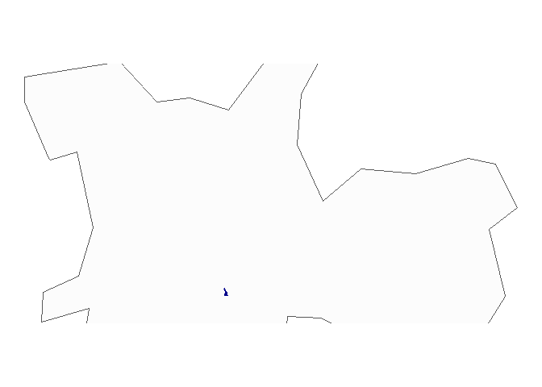

<!-- README.md is generated from README.Rmd. Please edit that file -->

# milton

<!-- badges: start -->

[](https://lifecycle.r-lib.org/articles/stages.html#experimental)
[](https://github.com/tomasbarcellos/milton/actions)
[](https://app.codecov.io/gh/tomasbarcellos/milton?branch=main)
<!-- badges: end -->

The goal of milton is to …

## Installation

You can install the development version of milton from
[GitHub](https://github.com/) with:

``` r
# install.packages("devtools")
devtools::install_github("tomasbarcellos/milton")
```

## Example

o pacote oferece uma série de funções de utilidade para trabalhar com
dados georreferenciados.

É possível buscar por endereços e encontrar suas coordenadas geográficas
com a função `get_addr`.

``` r
library(milton)
get_addr("Avenida Heróis do Acre")
#> # A tibble: 1 x 2
#>     lon   lat
#>   <dbl> <dbl>
#> 1 -38.5 -3.80
```

A função `geopart` permite identificar o polígono ao qual uma coordenada
(ou ponto) pertence.

Criando dados para usar nos exemplos a seguir.

Com `nearplace` é possível identificar o local (dado uma lista) mais
próximo de um ponto.

`min_dist` retorna a menor distância entre um ponto e um conjunto de
localidades.

# Caso de identificacao do setor censitario

Ler shapes

``` r
mun <- brazilmaps::get_brmap("City")

cens <- sf::st_read("inst/extdata/setor censitario", "DEINFO_SETOR_CENSITARIO_2010") %>%
  sf::st_transform("+proj=longlat +zone=23 +south +ellps=aust_SA +units=m +no_defs") %>%
  sf::st_as_sf()
#> Reading layer `DEINFO_SETOR_CENSITARIO_2010' from data source 
#>   `C:\Users\tomas.barcellos\Documents\projetos\milton-geo\inst\extdata\setor censitario' 
#>   using driver `ESRI Shapefile'
#> Simple feature collection with 18953 features and 5 fields
#> Geometry type: MULTIPOLYGON
#> Dimension:     XY
#> Bounding box:  xmin: 313434.5 ymin: 7343753 xmax: 360659.3 ymax: 7416233
#> Projected CRS: SAD69 / UTM zone 23S
```

Identicar o setor censitario e municipio de um endereco.

``` r
coord <- get_addr("Rua vergueiro")

sp <- geopart(coord, mun)
#> old-style crs object detected; please recreate object with a recent sf::st_crs()
#> old-style crs object detected; please recreate object with a recent sf::st_crs()
setor <- geopart(coord, cens)
```

E fazer um mapa.

``` r
library(ggplot2)

ggplot(sp) +
  geom_sf(fill = "gray99") +
  geom_sf(data = setor, col = "darkblue", fill = "darkblue") +
  coord_sf(ylim = c(-23.4, -23.6), ) +
  theme_void()
```


