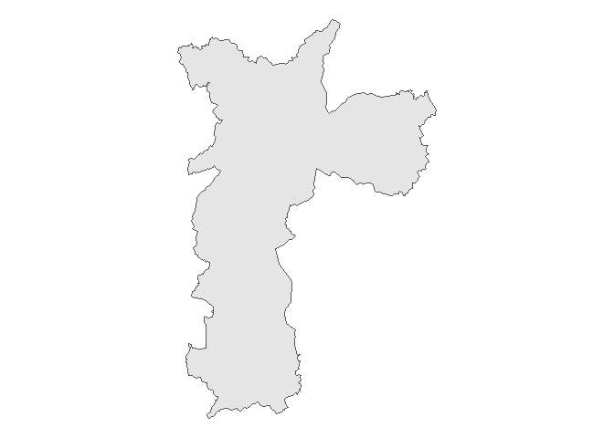

<!-- README.md is generated from README.Rmd. Please edit that file -->

# milton

<!-- badges: start -->

[](https://lifecycle.r-lib.org/articles/stages.html#experimental)
[](https://github.com/tomasbarcellos/milton/actions)
[](https://app.codecov.io/gh/tomasbarcellos/milton?branch=main)
<!-- badges: end -->

O objetivo de milton é oferecer ferramentas para facilitar o
georreferenciamento de dados no Brasil.

## Instalação

Você pode instalar a versão de desenvolvimento de milton do
[GitHub](https://github.com/) com o código abaixo:

``` r
# install.packages("devtools")
devtools::install_github("tomasbarcellos/milton")
```

``` r
library(milton)
```

# Georreferenciando endereços

O pacote permite que você georrefenrencie seus dados com:

1.  Endereço
2.  CEP

``` r
av <- get_addr("Avenida pequeno príncipe")
av
#> Geometry set for 1 feature 
#> Geometry type: POINT
#> Dimension:     XY
#> Bounding box:  xmin: -48.4922 ymin: -27.68202 xmax: -48.4922 ymax: -27.68202
#> Geodetic CRS:  SIRGAS 2000
#> POINT (-48.4922 -27.68202)
# CEP da avenida pequeno principe
get_addr("88063-000")
#> Geometry set for 1 feature 
#> Geometry type: POINT
#> Dimension:     XY
#> Bounding box:  xmin: -48.49422 ymin: -27.6804 xmax: -48.49422 ymax: -27.6804
#> Geodetic CRS:  SIRGAS 2000
#> POINT (-48.49422 -27.6804)
```

# Identificando pertencimento

Carregando funções de utilidade para ler e manipular dados.

``` r
library(tidyverse)
#> -- Attaching packages --------------------------------------- tidyverse 1.3.1 --
#> v ggplot2 3.3.5     v purrr   0.3.4
#> v tibble  3.1.5     v dplyr   1.0.7
#> v tidyr   1.1.4     v stringr 1.4.0
#> v readr   2.0.2     v forcats 0.5.1
#> -- Conflicts ------------------------------------------ tidyverse_conflicts() --
#> x dplyr::filter() masks stats::filter()
#> x dplyr::lag()    masks stats::lag()
```

Também é possível identificar o município e o setor censitário de um
endereço. Para tanto precisamos dos endereços que vamos localizar e as
geometrias em que eles devem ser identificados.

``` r
mun <- geobr::read_municipality(year = 2018) %>% 
  rename(geometry = geom)
```

A função `geopart` permite fazê-lo.

``` r
geo_av <- geopart(av, mun)
ggplot(mun[geo_av, ]) +
  geom_sf() +
  theme_void()
```


A API do pacote foi construída buscando permitir o uso do pipe (`%>%`).

``` r
geo_cast <- get_addr("Estádio Arena Castelão") %>% 
  geopart(mun)

ggplot(mun[geo_cast, ]) +
  geom_sf() +
  theme_void()
```



Para a identificação do setor censitário também é possível usar a mesma
função. Para tanto deve-se usar como segundo argumento os polígonos dos
setores censitários. Uma forma fácil de acessar esses polígonos é usando
o pacote `geobr`: `geobr::read_census_tract`.

``` r
setores <- geobr::read_census_tract(3550308) %>% 
  rename(geometry = geom)
```

Com estes polígonos em mãos é possível identificar o setor censitário ao
qual determinado endereço pertence.

``` r
epm <- get_addr("Rua botucatu, 740")

geo_epm <- geopart(epm, setores)

ggplot(setores[geo_epm, ]) +
  geom_sf() +
  theme_void()
```


Outra funcionalidade do pacote permite relacionar endereços distintos,
medindo suas distâncias ou identificando o local mais próximo.

Suponhamos que tenhamos uma tabela com os endereços os pacientes A, B e
C:

``` r
pacientes <- tibble(
  paciente = LETTERS[1:3],
  endereco = c(
    "Av. Dr. Altino Arantes, 941",
    "Rua Gandavo, 349, São Paulo",
    "Rua Bela cruz, 40"
  )
) %>% 
  mutate(latlon = map(endereco, get_addr))

pacientes
#> # A tibble: 3 x 3
#>   paciente endereco                    latlon           
#>   <chr>    <chr>                       <list>           
#> 1 A        Av. Dr. Altino Arantes, 941 <POINT (-46.6...>
#> 2 B        Rua Gandavo, 349, São Paulo <POINT (-46.6...>
#> 3 C        Rua Bela cruz, 40           <POINT (-46.5...>
```

E agora é possível calcular a distância entre esses pontos e a Escola
Paulista de Medicina.

``` r
pacientes %>% 
  mutate(distancia_km = map_dbl(latlon, distancia, y = epm))
#> # A tibble: 3 x 4
#>   paciente endereco                    latlon            distancia_km
#>   <chr>    <chr>                       <list>                   <dbl>
#> 1 A        Av. Dr. Altino Arantes, 941 <POINT (-46.6...>        0.752
#> 2 B        Rua Gandavo, 349, São Paulo <POINT (-46.6...>        0.827
#> 3 C        Rua Bela cruz, 40           <POINT (-46.5...>        6.82
```

Há um conjunto de funções que permite identificar, por exemplo, o local
mais adequado para tratar determinado paciente:

1.  `min_dist` retorna a menor distância;
2.  `nearplace` retorna o local mais próximo.

Desse modo, dado um conjunto de hospitais:

``` r
hospitais <- c("Hospital São Paulo", 
               "Hospital Dom Alvarenga",
               "Hospital Paulistano")

geo_hospitais <- hospitais %>% 
  map(get_addr) %>% 
  reduce(c)
```

É possível identificar a distância dos hospitais para o paciente C:

``` r
paciente_C <- pacientes$latlon[[3]]
distancia(paciente_C, geo_hospitais)
#>          [,1]     [,2]    [,3]
#> [1,] 6.802523 3.571139 6.42353
```

Assim como o hospital de menor distância.

``` r
min_dist(paciente_C, geo_hospitais)
#> [1] 3.571139
```

E o hospital mais próximo.

``` r
prox <- nearplace(paciente_C, geo_hospitais)
idx <- which(prox == geo_hospitais)
hospitais[idx]
#> [1] "Hospital Dom Alvarenga"
```

# Usando CEPs

Tomemos um conjunto qualquer de CEPs.

``` r
df_ceps <- tibble(
  cep = c("01215010", "01508010", "01519000", "01526010", "02180080", 
          "02849170", "03347070", "03380150", "03590080", "03737230", 
          "04011060", "04018000", "04050060", "04108001", "04111000",
          "04233140", "04421150", "04433180", "04633030", "04813190",
          "04853185", "05010000", "05409002", "05540020", "05790230",
          "06000150", "07717170", "07858150", "07865115", "08062320", 
          "08140000", "08142710", "08370220", "08421520", "08700000",
          "08770130", "08790000", "08793030", "09911550")
)
```

Assumamos que representam o endereço de pacientes cujas condições estão
apresentadas na tabela abaixo.

``` r
set.seed(123)
df_pacientes <- df_ceps %>% 
  mutate(
    id = seq_along(cep),
    condicao = sample(c(0, 1), length(cep), replace = TRUE)
  )

df_pacientes
#> # A tibble: 39 x 3
#>    cep         id condicao
#>    <chr>    <int>    <dbl>
#>  1 01215010     1        0
#>  2 01508010     2        0
#>  3 01519000     3        0
#>  4 01526010     4        1
#>  5 02180080     5        0
#>  6 02849170     6        1
#>  7 03347070     7        1
#>  8 03380150     8        1
#>  9 03590080     9        0
#> 10 03737230    10        0
#> # ... with 29 more rows
```

Agora usemos as funções do pacote para complementar nosso bando de dados
com:

1.  Georreferenciamento dos pacientes
2.  Identificação do setor censitário em que os pacientes estão
    localizados
3.  Relacionamento com dados do IPVS do referido setor censitário
4.  Identificação do ponto mais próximo de cada paciente (dado uma
    lista)
5.  Cálculo da distância entre os pacitentes e o ponto definido em 4)
6.  Criar mapa dos pacientes (leaflet)

### 1. Georreferenciamento dos pacientes

``` r
geo_pacientes <- df_pacientes %>% 
  mutate(endereco = map_chr(cep, milton:::cep),
         ponto = map(endereco, get_addr))
```

### 2. Identificação do setor censitário em que os pacientes estão localizados

``` r
setor_paciente <- geo_pacientes %>% 
  mutate(idx = map_int(ponto, geopart, setores),
         setor = setores$code_tract[idx])
```

### 3. Relacionamento com dados do IPVS do referido setor censitário

Ler dados do Índice Paulista de Vulnerabilidade Social (IPVS).

``` r
ipvs <- ler_ipvs() %>% 
  select(setor = codigo_do_setor_censitario, 
         idade_media_setor = idade_media_das_pessoas_responsaveis, 
         p_renda_meio_sm_setor =  proporcao_de_domicilios_particulares_com_rendimento_nominal_mensal_de_ate_1_2_s_m,
         p_alfabetizadas_setor = proporcao_de_pessoas_responsaveis_alfabetizadas)
```

Relacionar com dados dos pacientes

``` r
paciente_ipvs <- setor_paciente %>% 
  left_join(ipvs, by = "setor")
paciente_ipvs
#> # A tibble: 39 x 10
#>    cep         id condicao endereco       ponto      idx setor  idade_media_set~
#>    <chr>    <int>    <dbl> <chr>          <list>   <int> <chr>             <dbl>
#>  1 01215010     1        0 Rua Helvétia   <POINT ~ 13923 35503~             41.7
#>  2 01508010     2        0 Rua Taguá      <POINT ~ 10240 35503~             44.3
#>  3 01519000     3        0 Rua do Lavapés <POINT ~ 10223 35503~             37.6
#>  4 01526010     4        1 Rua Tenente O~ <POINT ~ 10167 35503~             48.4
#>  5 02180080     5        0 Rua Soldado M~ <POINT ~ 17418 35503~             50.0
#>  6 02849170     6        1 Rua Bernardo ~ <POINT ~  1001 35503~             48.3
#>  7 03347070     7        1 Rua Maestro A~ <POINT ~   107 35503~             56.0
#>  8 03380150     8        1 Rua Cruzeiro ~ <POINT ~ 16920 35503~             48.6
#>  9 03590080     9        0 Rua Padre Man~ <POINT ~   536 35503~             49.4
#> 10 03737230    10        0 Rua Conceição~ <POINT ~    NA <NA>               NA  
#> # ... with 29 more rows, and 2 more variables: p_renda_meio_sm_setor <dbl>,
#> #   p_alfabetizadas_setor <dbl>
```

### 4. Identificação do ponto mais próximo de cada paciente (dado uma lista)

Dados dois pontos, identificar aquele mais próximo de cada paciente.

``` r
ps <- c(get_addr("04017-030"), get_addr("Hospital Albert Einstein"))
nomes_ps <- c("Caism Vila Mariana", "Einstein")

paciente_ipvs %>% 
  head(9) %>%
  select(id, condicao, cep, endereco, ponto) %>% 
  mutate(ponto = reduce(ponto, c),
         prox = nomes_ps[map(nearplace(ponto, ps), sf::st_equals, ps) %>% unlist()])
#> # A tibble: 9 x 6
#>      id condicao cep      endereco                               ponto prox     
#>   <int>    <dbl> <chr>    <chr>                            <POINT [°]> <chr>    
#> 1     1        0 01215010 Rua Helvétia            (-46.64122 -23.5331) Caism Vi~
#> 2     2        0 01508010 Rua Taguá              (-46.63652 -23.56167) Caism Vi~
#> 3     3        0 01519000 Rua do Lavapés         (-46.62748 -23.56164) Caism Vi~
#> 4     4        1 01526010 Rua Tenente Otávio Go~ (-46.63209 -23.56342) Caism Vi~
#> 5     5        0 02180080 Rua Soldado Manasses ~ (-46.56587 -23.51827) Caism Vi~
#> 6     6        1 02849170 Rua Bernardo Rincon    (-46.68629 -23.46706) Caism Vi~
#> 7     7        1 03347070 Rua Maestro Artur Eli~  (-46.5665 -23.56242) Caism Vi~
#> 8     8        1 03380150 Rua Cruzeiro dos Peix~ (-46.53379 -23.57575) Caism Vi~
#> 9     9        0 03590080 Rua Padre Manuel Barr~ (-46.48273 -23.54557) Caism Vi~
```

### 5. Cálculo da distância entre os pacitentes e o ponto definido em 4)

``` r
paciente_ipvs %>% 
  head(9) %>%
  select(id, condicao, cep, endereco, ponto) %>% 
  mutate(ponto = reduce(ponto, c),
         # Em quilometros
         distancias = distancia(ponto, ps))
#> # A tibble: 9 x 6
#>      id condicao cep      endereco                    ponto distancias[,1]  [,2]
#>   <int>    <dbl> <chr>    <chr>                 <POINT [°]>          <dbl> <dbl>
#> 1     1        0 01215010 Rua Helvét~  (-46.64122 -23.5331)           6.08  6.56
#> 2     2        0 01508010 Rua Taguá   (-46.63652 -23.56167)           2.90  3.38
#> 3     3        0 01519000 Rua do Lav~ (-46.62748 -23.56164)           3.09  3.57
#> 4     4        1 01526010 Rua Tenent~ (-46.63209 -23.56342)           2.77  3.25
#> 5     5        0 02180080 Rua Soldad~ (-46.56587 -23.51827)          10.7  11.1 
#> 6     6        1 02849170 Rua Bernar~ (-46.68629 -23.46706)          14.3  14.7 
#> 7     7        1 03347070 Rua Maestr~  (-46.5665 -23.56242)           7.81  8.07
#> 8     8        1 03380150 Rua Cruzei~ (-46.53379 -23.57575)          10.7  10.9 
#> 9     9        0 03590080 Rua Padre ~ (-46.48273 -23.54557)          16.5  16.7
```

### 6. Criar mapa dos pacientes (leaflet)

``` r
library(leaflet)
#> Warning: package 'leaflet' was built under R version 4.1.2
lat_ps <- unlist(ps[[1]])[2]
lon_ps <- unlist(ps[[1]])[1]

paciente_ipvs %>% 
  head(9) %>% 
  mutate(lon = map_dbl(ponto, ~unlist(.x)[1]),
         lat = map_dbl(ponto, ~unlist(.x)[2])) %>% 
  leaflet() %>%
  addTiles() %>%  # Add default OpenStreetMap map tiles
  addCircleMarkers(~lon, ~lat, label = ~cep, color = ~ifelse(condicao == 1, "red", "blue")) %>% 
  addMarkers(lon_ps, lat_ps, label = "Caism Vila Mariana") %>% 
  addLegend(colors = c("red", "blue"), labels = c("Com condição", "Sem condição"))
```

<div id="htmlwidget-4b8e1fe96c0688a84916" style="width:100%;height:480px;" class="leaflet html-widget"></div>
<script type="application/json" data-for="htmlwidget-4b8e1fe96c0688a84916">{"x":{"options":{"crs":{"crsClass":"L.CRS.EPSG3857","code":null,"proj4def":null,"projectedBounds":null,"options":{}}},"calls":[{"method":"addTiles","args":["//{s}.tile.openstreetmap.org/{z}/{x}/{y}.png",null,null,{"minZoom":0,"maxZoom":18,"tileSize":256,"subdomains":"abc","errorTileUrl":"","tms":false,"noWrap":false,"zoomOffset":0,"zoomReverse":false,"opacity":1,"zIndex":1,"detectRetina":false,"attribution":"&copy; <a href=\"http://openstreetmap.org\">OpenStreetMap<\/a> contributors, <a href=\"http://creativecommons.org/licenses/by-sa/2.0/\">CC-BY-SA<\/a>"}]},{"method":"addCircleMarkers","args":[[-23.5330976,-23.5616706,-23.5616405,-23.5634204,-23.5182701,-23.4670588,-23.5624241,-23.5757523,-23.5455713],[-46.6412249,-46.6365158,-46.6274813,-46.6320893,-46.5658705,-46.6862926,-46.5665026,-46.5337924,-46.4827332],10,null,null,{"interactive":true,"className":"","stroke":true,"color":["blue","blue","blue","red","blue","red","red","red","blue"],"weight":5,"opacity":0.5,"fill":true,"fillColor":["blue","blue","blue","red","blue","red","red","red","blue"],"fillOpacity":0.2},null,null,null,null,["01215010","01508010","01519000","01526010","02180080","02849170","03347070","03380150","03590080"],{"interactive":false,"permanent":false,"direction":"auto","opacity":1,"offset":[0,0],"textsize":"10px","textOnly":false,"className":"","sticky":true},null]},{"method":"addMarkers","args":[-23.5877375,-46.6379472155264,null,null,null,{"interactive":true,"draggable":false,"keyboard":true,"title":"","alt":"","zIndexOffset":0,"opacity":1,"riseOnHover":false,"riseOffset":250},null,null,null,null,"Caism Vila Mariana",{"interactive":false,"permanent":false,"direction":"auto","opacity":1,"offset":[0,0],"textsize":"10px","textOnly":false,"className":"","sticky":true},null]},{"method":"addLegend","args":[{"colors":["red","blue"],"labels":["Com condição","Sem condição"],"na_color":null,"na_label":"NA","opacity":0.5,"position":"topright","type":"unknown","title":null,"extra":null,"layerId":null,"className":"info legend","group":null}]}],"limits":{"lat":[-23.5877375,-23.4670588],"lng":[-46.6862926,-46.4827332]}},"evals":[],"jsHooks":[]}</script>
